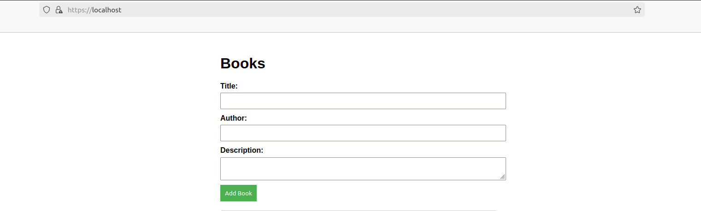

# 🌟 Book API Application

Welcome to the **Book API Application!** This project features a **Laravel API** and a **Nuxt.js client**, all neatly organized and orchestrated using **Docker** and **Docker Compose**. 🎉

## 📋 Table of Contents
- [Overview](#overview)
- [Prerequisites](#prerequisites)
- [Getting Started](#getting-started)
- [Creating a Self-Signed Certificate](#creating-a-self-signed-certificate)
- [Running the Application](#running-the-application)
- [Migrating the Database](#migrating-the-database)
- [Adding the Self-Signed Certificate to Trusted Certificates](#adding-the-self-signed-certificate-to-trusted-certificates)
- [Accessing the Application](#accessing-the-application)
- [License](#license)

---

## 📖 Overview

This repository contains a simple web application with two main components:

1. **API**: Written in Laravel PHP, the API serves as the backend for the application and listens on port 8000.
2. **Client**: Developed using Nuxt.js, the client is the frontend of the application and listens on port 3000.

### Environment Variables

- **API Directory**: Take a look at the `.env` file in the API directory. It should contain the necessary credentials to connect to the database.

  ```env
  DB_CONNECTION=mysql
  DB_HOST=db
  DB_PORT=3306
  DB_DATABASE=bookapi
  DB_USERNAME=app
  DB_PASSWORD=password
  ```

- **Client Directory**: Check the `.env` file in the Client directory. It should contain the connection string to connect to the API.


  ```env
    VITE_API_URL=http://api:8000
  ```

## ✅ prerequisites  


### Before you begin, ensure you have the following installed:

   1. **Docker** and **Docker Compose** on your machine.
   2. Basic knowledge of using the **terminal/command** line. 💻

## 🚀 Getting Started
   1. Clone the repository:
   
        ```bash
            git clone https://github.com/AmrTarek17/Challenge.git
            cd Challenge
        ```
   2. Create the required directories for certificates:
   
        ```bash
            mkdir certs
        ```
## 🔒 Creating a Self-Signed Certificate

   1. Use OpenSSL to create a self-signed certificate and a private key:
   
        ```bash
            openssl req -x509 -nodes -days 365 -newkey rsa:2048 -keyout certs/server.key -out certs/server.crt
        ```
        Fill in the prompted details as needed. The default values are often acceptable for local development. 🛡️
## 🛠️ Running the Application
   1. Build and start the application:
        
        ```bash
            docker-compose up --build
        ```
        This command builds the Docker images and starts all services defined in the docker-compose.yml file. 🏗️
            
## 📦 Migrating the Database
   1. Once the containers are running, open a terminal and run the following command to migrate the database:
        ```bash
            docker-compose exec api php artisan migrate
        ```
        This command applies all outstanding migrations to your database. 📈
## 🛠️ Adding the Self-Signed Certificate to Trusted Certificates ( optional)
### On Linux

   1. Copy the self-signed certificate to the trusted certificates directory:
   
        ```bash
            sudo cp certs/server.crt /usr/local/share/ca-certificates/
        ```
   2. Update the CA certificates:
   
        ```
            sudo update-ca-certificates
        ```
### On macOS
   1. Open the Keychain Access application.
   2. Drag and drop server.crt into the System keychain.
   3. Set the certificate to Always Trust.
## 🌐 Accessing the Application

   1. The API will be accessible at ```https://localhost/api```.
   2. The client will be accessible at ```https://localhost```.
   
> [!NOTE]
> If you encounter SSL certificate errors, you can bypass verification (not recommended for production) by using:```curl -k https://localhost```

## 📸 Application Screenshot

Here are some screenshots of the application up and running with Docker Compose:




                
Thank you for checking out the Book API Application! If you have any questions, feel free to open an issue or reach out. Happy coding! 🚀
